# live-ecg — 실시간 단일 유도 심전도 분석 엔진

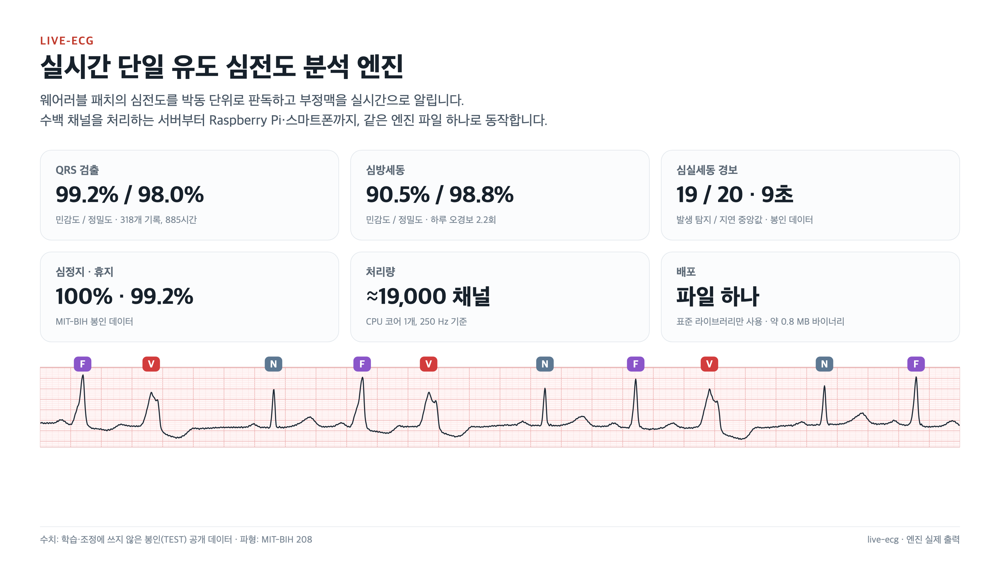

live-ecg는 웨어러블 심전도 패치처럼 **유도 하나**로 기록되는 심전도를 **실시간으로** 분석하는 엔진입니다.
심장 박동을 하나하나 찾아 분류하고, 부정맥 에피소드를 판정하고, 생명을 위협하는 리듬이 나타나면 경보를 냅니다.

- **어디서나 같은 엔진:** 수백 채널을 동시에 처리하는 서버에서도, Raspberry Pi나 스마트폰에서도 같은 엔진 파일 하나로 동작합니다.
- **정직한 성능 수치:** 모든 수치는 학습과 조정에 한 번도 쓰지 않은 공개 데이터(봉인 구역)에서 측정했습니다. 잘 되는 부분과 아직 부족한 부분을 함께 공개합니다.

> 이 자료의 모든 파형과 결과 화면은 공개 데이터베이스(PhysioNet)의 기록을 엔진에 실제로 통과시켜 얻은 출력입니다.
> live-ecg는 연구·개발 단계의 소프트웨어이며, 의료기기로 인증받지 않았습니다.

---

## 1. 박동 분류

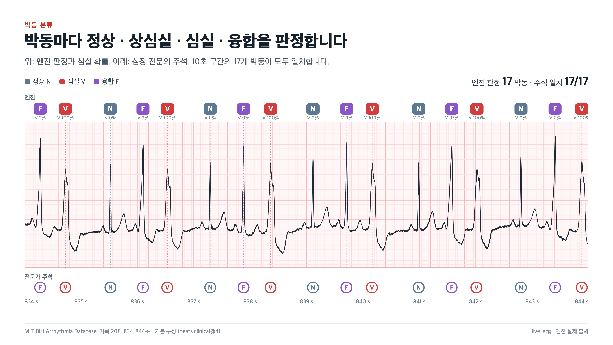

검출된 박동마다 **정상(N) · 상심실(S) · 심실(V) · 융합(F)** 중 하나로 판정합니다.
박동 모양, 환자 고유의 기준 박동과의 차이, 박동 간격, 심방 활동(P파)을 함께 보고, 서로 다른 질문에 특화된 판별기들이 각자의 기준값으로 판정합니다.
V 판별기는 넓은 QRS가 심실에서 왔는지, 변행전도로 넓어졌는지를 가리는 임상 기준을 단일 유도에 맞게 옮겨 씁니다.

- **판정 근거 제공:** 박동마다 심실·상심실·융합 확률을 함께 내보냅니다. 판정이 어떤 확신으로 나왔는지 호스트가 볼 수 있습니다.
- **판정 보류:** 신호 품질이 나쁘거나 환자의 기준 박동이 아직 만들어지지 않았으면 판정하지 않고 "판정 보류"로 표시합니다.

| MIT-BIH 봉인 데이터 | 민감도 | 정밀도 |
|---|---:|---:|
| 심실 박동 (분류만) | 95.1% | 83.3% |
| 심실 박동 (검출부터 끝까지, MIT-BIH + SVDB) | 94.3% | 76.9% |
| 심실 박동 (INCART, II 유도) | 88.8% | 91.6% |

## 2. 심방세동

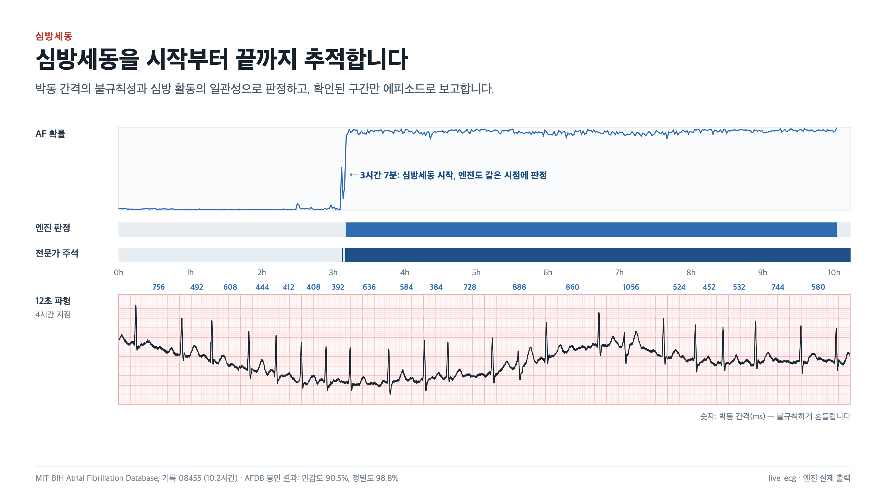

박동 간격이 얼마나 불규칙한지와 심방 활동이 얼마나 일관된지를 함께 보고 심방세동을 판정합니다.
확인된 구간만 에피소드로 보고하므로, 박동 몇 개가 흔들린다고 경보가 울리지 않습니다.
심방세동 중에는 "조기 박동"이라는 개념이 성립하지 않으므로, 상심실 박동 판정을 자동으로 멈춥니다.

| AFDB 봉인 데이터, 검출부터 끝까지 | 결과 |
|---|---:|
| 민감도 / 정밀도 | 90.5% / 98.8% |
| 30초 이상 에피소드 탐지 | 33 / 34 |
| 심방세동이 없는 기록 270시간의 오경보 | 하루 2.2회 |

## 3. 심실세동 경보

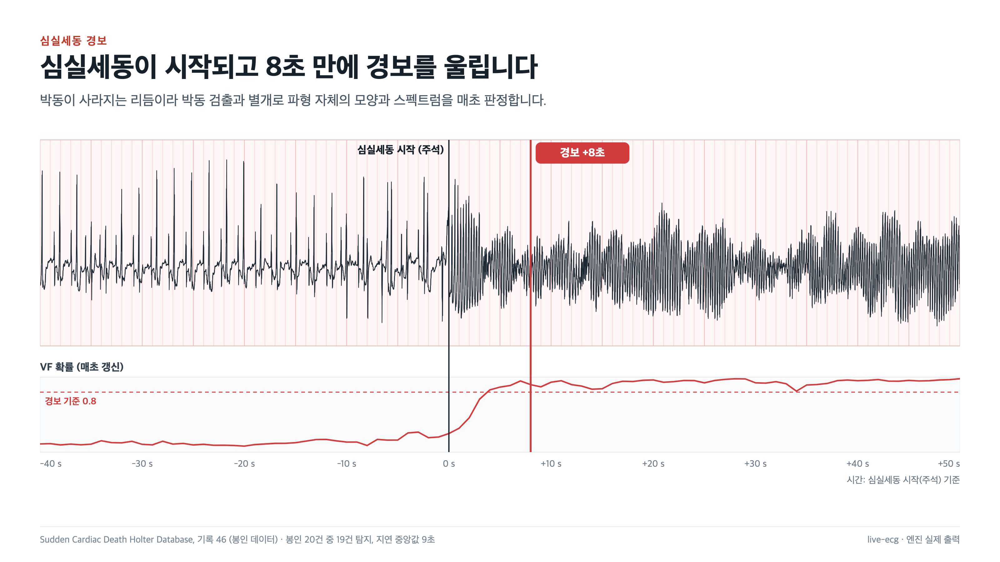

심실세동에서는 박동 자체가 사라지므로, 박동 검출과 별도로 **파형 자체의 모양과 주파수 스펙트럼을 매초 판정**합니다.
확률이 경보 기준을 넘는 상태가 4초 이상 이어지면 경보를 울립니다.

| 돌연심장사 Holter DB (봉인 23건, 447시간) | 결과 |
|---|---:|
| 심실세동 발생 탐지 | 19 / 20 |
| 경보까지 지연 (중앙값) | 9초 |
| 발생 전 구간의 오경보 | 하루 5.0회 (기록 1건에 집중, 나머지 22건은 하루 0.61회) |
| 그 외 봉인 Holter 616시간의 오경보 | 4회 |

## 4. 휴지 · 심정지

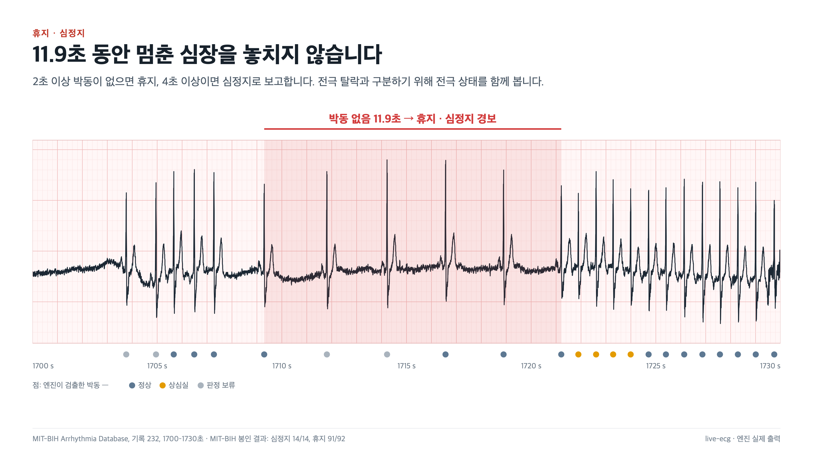

박동이 2초 이상 없으면 휴지, 4초 이상이면 심정지로 보고합니다.
평평한 신호는 전극이 떨어져도 똑같이 보이므로, 전극 상태를 따로 확인해 둘을 구분합니다.
판단이 애매할 때는 "놓치지 않는 쪽"을 택합니다. 심정지를 놓치는 대가가 오경보보다 훨씬 크기 때문입니다.

| MIT-BIH 봉인 데이터 | 민감도 | 정밀도 |
|---|---:|---:|
| 심정지 | 100% (14/14) | 100% |
| 휴지 | 99.2% | 99.2% |
| 서맥 / 빈맥 | 99.5% / 97.6% | 95.7% / 100% |

## 5. 신호 품질

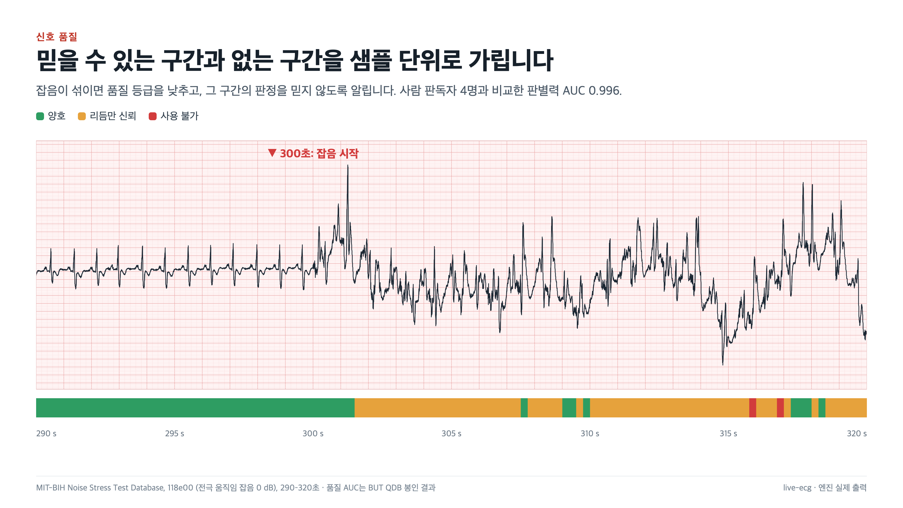

샘플마다 신호 품질을 **양호 · 리듬만 신뢰 · 사용 불가** 세 등급으로 판정합니다.
포화, 평탄 신호, 기저선 흔들림, 근육 잡음, 낮은 진폭, 전극 탈락을 각각 따로 표시하고, 품질이 나쁜 구간에서는 엔진이 스스로 학습을 멈춥니다.
사람 판독자 4명의 품질 평가와 비교한 판별력은 AUC 0.996입니다(BUT QDB 봉인 데이터).

## 6. 심실 검토 큐

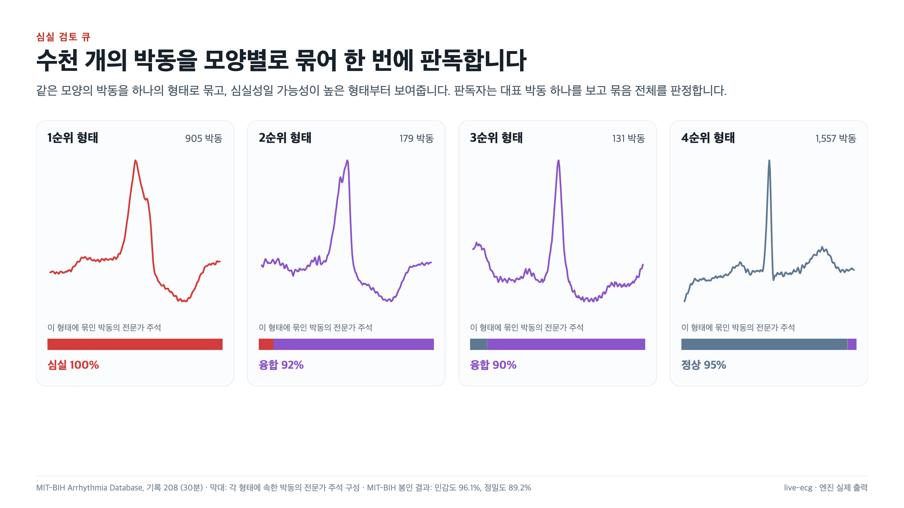

장시간 기록에는 수만 개의 박동이 있습니다. 엔진은 같은 모양의 박동을 하나의 **형태**로 묶고, 심실성일 가능성이 높은 형태부터 보여줍니다.
판독자는 대표 박동 하나를 보고 그 형태에 묶인 박동 전체를 한 번에 판정합니다.

| 검토 큐 | 민감도 | 정밀도 | 기록당 검토할 형태 수 |
|---|---:|---:|---:|
| MIT-BIH 봉인 데이터 | 96.1% | 89.2% | 8.3 |

## 7. 성능 한눈에 보기

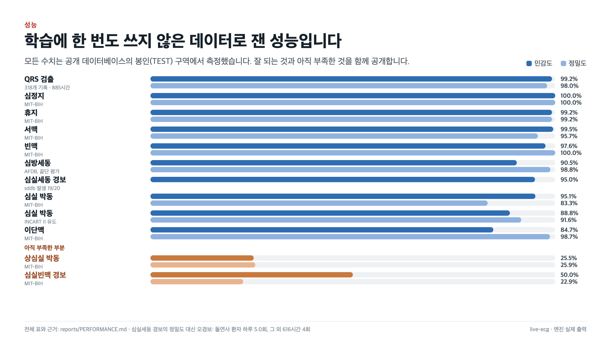

모든 수치는 공개 데이터베이스의 **봉인(TEST) 구역**에서 측정했습니다. 이 구역은 모델 학습에도, 기준값 조정에도 쓰지 않았습니다.
아직 부족한 부분도 숨기지 않습니다.

- **상심실 박동:** MIT-BIH에서 민감도·정밀도가 약 25%입니다. 단일 유도에서는 P파가 너무 작아서 박동 하나만으로는 가려내기 어렵습니다. 그래서 패치용 설정에서는 리듬 수준(상심실 런)으로 찾습니다.
- **심실빈맥 경보:** 정밀도가 22.9%입니다. 넓은 QRS 변행전도와 심실 박동을 단일 유도로 구분하는 문제가 남아 있습니다.

## 8. 구조 — 엔진 전체도, 단계 하나도 교체

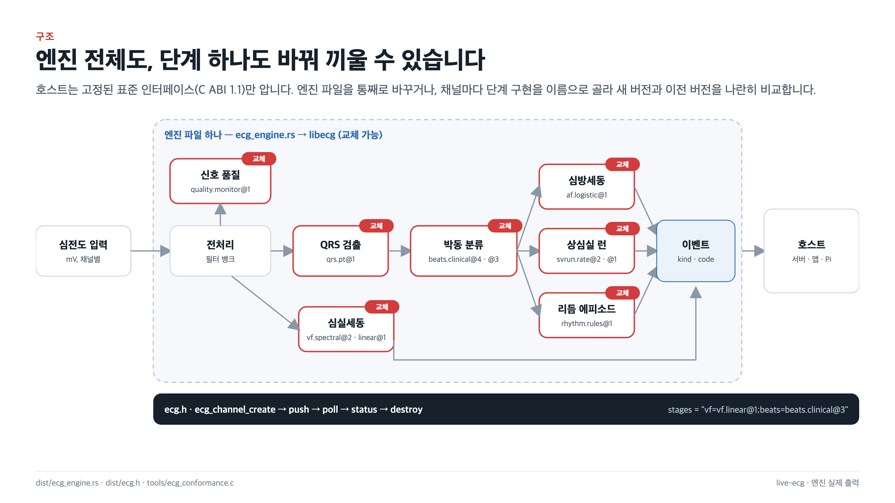

엔진은 자주 개선되어야 하고, 그때마다 서버나 앱이 바뀌어서는 안 됩니다. 그래서 엔진과 그것을 쓰는 프로그램 사이의 경계를 표준으로 고정했습니다.

- **엔진 전체 교체:** 엔진 전체가 파일 하나(`ecg_engine.rs`)로 배포되고, 라이브러리(`libecg`)와 헤더(`ecg.h`)로 빌드됩니다. 호스트는 라이브러리 파일만 바꾸면 새 엔진을 씁니다.
- **단계별 교체:** 신호 품질, QRS 검출, 박동 분류, 심방세동, 심실세동, 상심실 런, 리듬 에피소드는 각각 교체 가능한 단계입니다. 채널마다 `"vf=vf.linear@1;beats=beats.clinical@3"`처럼 이름으로 구현을 고를 수 있습니다. 새 버전과 이전 버전을 같은 신호에서 나란히 돌려 비교하거나, 엔진을 바꾸지 않고 이전 버전으로 되돌릴 수 있습니다.
- **호환 규칙:** 인터페이스 버전(ABI)의 메이저 번호가 같으면 추가만 허용합니다. 호스트는 모르는 이벤트를 건너뛰므로, 새 엔진이 새로운 판정을 내보내도 기존 호스트가 깨지지 않습니다.
- **추적성:** 모든 채널이 자신이 쓰는 단계의 이름과 버전을 알려줍니다. 어떤 판정을 어느 구현이 냈는지 추적할 수 있습니다.

## 9. 새 엔진의 자동 검증

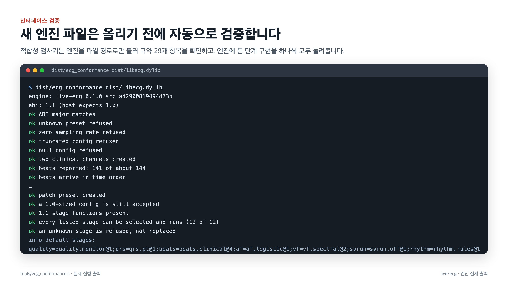

교체할 엔진 파일은 올리기 전에 적합성 검사기로 확인합니다.
검사기는 엔진을 파일 경로로만 불러 인터페이스 규약 29개 항목을 확인하고, 엔진에 든 모든 단계 구현을 하나씩 실제로 돌려봅니다.
이와 별도로, 단일 파일로 만든 엔진과 개발 소스의 엔진이 같은 입력에 **비트 단위로 같은 결과**를 내는지 테스트로 보장합니다.

## 10. 배포

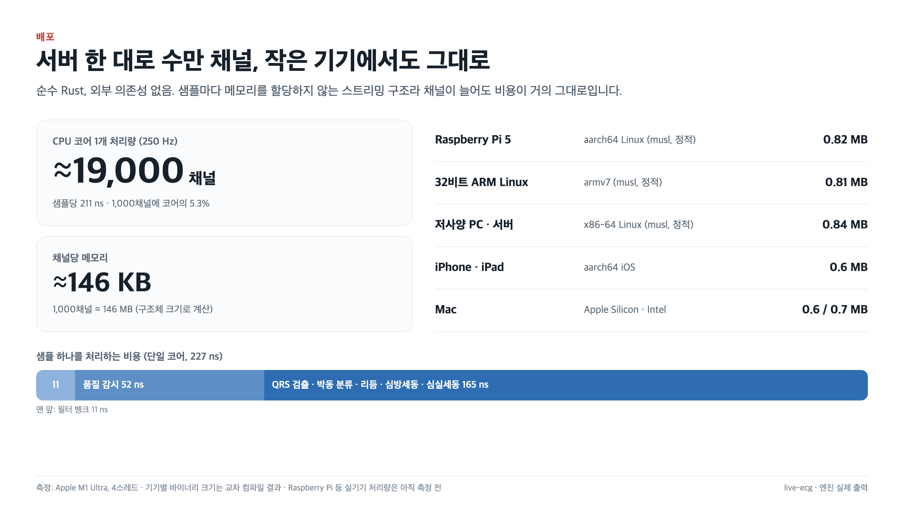

- **순수 Rust:** 외부 의존성이 없습니다.
- **스트리밍 구조:** 샘플을 처리하는 동안 메모리를 새로 할당하지 않습니다.
- **처리량:** CPU 코어 하나로 250 Hz 신호 약 19,000채널을 처리합니다(Apple M1 Ultra 기준).
- **바이너리:** Raspberry Pi 5, 32비트 ARM, x86-64 Linux, iOS, macOS용이 모두 1 MB 미만입니다.
- **아직 측정하지 않은 것:** Raspberry Pi 같은 실제 기기에서의 처리량은 아직 측정하지 않았습니다.

---

## 검증 원칙

- **정답의 기준:** 정답은 기기와 무관한 **전문가 주석**(공개 데이터베이스)과 **분석사가 확정한 판정**뿐입니다. 기존 장비의 자동 판정은 비교 대상일 뿐, 학습에도 평가에도 정답으로 쓰지 않습니다.
- **데이터 분리:** 환자 단위로 학습·개발·봉인 구역을 나누었습니다. 기준값은 개발 구역에서 고르고, 봉인 구역은 결정이 끝난 뒤에 한 번만 채점합니다.
- **분리가 지켜지지 않은 곳의 공개:** 분리가 지켜지지 않은 곳과 봉인 결과가 선택에 영향을 줄 수 있었던 곳은 모두 성능 보고서에 공개합니다.

## 데이터 출처

이 자료의 파형은 PhysioNet에 공개된 다음 데이터베이스에서 가져왔습니다. 각 데이터베이스의 라이선스와 인용 조건을 따릅니다.

- MIT-BIH Arrhythmia Database (기록 208, 232)
- MIT-BIH Atrial Fibrillation Database (기록 08455)
- Sudden Cardiac Death Holter Database (기록 46)
- MIT-BIH Noise Stress Test Database (기록 118e00)

Goldberger A. et al., *PhysioBank, PhysioToolkit, and PhysioNet*, Circulation 101(23):e215–e220, 2000.

## 이미지 목록

| 파일 | 내용 |
|---|---|
| `images/01_overview.png` | 대표 화면: 핵심 성능 수치 |
| `images/02_beat_classification.png` | 박동 분류와 전문가 주석 비교 |
| `images/03_atrial_fibrillation.png` | 10시간 심방세동 추적 |
| `images/04_vf_alarm.png` | 심실세동 발생과 경보 시점 |
| `images/05_pause_asystole.png` | 11.9초 휴지 검출 |
| `images/06_signal_quality.png` | 잡음 구간의 품질 판정 |
| `images/07_review_queue.png` | 형태별 심실 검토 큐 |
| `images/08_performance.png` | 봉인 데이터 성능 요약 |
| `images/09_architecture.png` | 엔진 구조와 교체 방식 |
| `images/10_conformance.png` | 적합성 검사 실행 화면 |
| `images/11_deployment.png` | 처리량과 배포 대상 |

모든 이미지는 3200×1800 PNG(16:9, 2배 해상도)입니다. 웹에서는 1600×900으로 표시하면 선명하게 보입니다.
